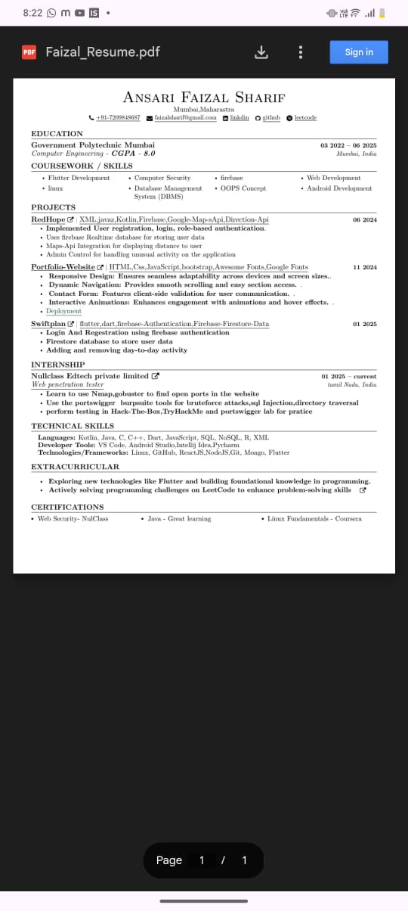

# 🌐 WebView Maker – Flutter WebView Application

A **production-ready Flutter WebView application** designed to wrap modern web apps with full native capabilities such as file upload, downloads, permissions, connectivity handling, location access, PDF viewing, animations, and clean state management.

This project is suitable for **SaaS dashboards, admin panels, portfolios, and web-based platforms** that require a native mobile shell.

---

## ✨ Features

- 📱 Modern Flutter WebView (Android & iOS)
- 📂 File upload & download support
- 🌐 Internet connectivity monitoring
- 📍 Location access using device GPS
- 🔐 Runtime permission handling
- 📄 In-app PDF viewer
- 🎞️ Lottie animations
- 🚀 Custom splash screen & launcher icons
- 🧠 State management using Provider
- 🔗 External URL handling
- ⚡ Optimized networking with Dio

---

## 🛠️ Packages Used

## 📦 Packages Used & Their Purpose

| Package | Why it is used |
|------|------|
| **cupertino_icons** | Provides iOS-style icons so the app looks native and consistent on Apple devices. |
| **webview_flutter** | Handles the core WebView functionality that loads and renders web content inside the Flutter app. |
| **webview_flutter_android** | Adds Android-specific WebView support and ensures better compatibility and performance on Android devices. |
| **flutter_inappwebview** | Used for advanced WebView control such as intercepting URLs, managing cookies, handling permissions, and injecting JavaScript. |
| **file_picker** | Allows users to select files from their device, mainly for upload actions inside the WebView. |
| **flutter_pdfview** | Enables smooth in-app PDF viewing instead of forcing users to open PDFs in external apps. |
| **connectivity_plus** | Detects internet connection status and helps display a proper “No Internet” screen when the network is unavailable. |
| **provider** | Manages app-level state in a clean and scalable way without over-engineering the architecture. |
| **permission_handler** | Handles runtime permissions such as storage and location in a user-friendly and safe manner. |
| **geolocator** | Fetches the user’s real-time location and injects it into the WebView when location access is required. |
| **dio** | Used for secure and efficient network requests, especially for downloading authenticated files like PDFs. |
| **path_provider** | Provides access to device directories for storing downloaded files temporarily or locally. |
| **url_launcher** | Opens external links (such as phone calls, emails, or external websites) outside the WebView when required. |
| **lottie** | Adds lightweight, smooth animations for splash screens and loading states to improve user experience. |
| **rflutter_alert** | Displays clean and customizable alert dialogs for confirmations and error handling. |
| **flutter_launcher_icons** | Generates consistent app icons for Android and iOS from a single source image. |
| **flutter_native_splash** | Creates a native splash screen that appears instantly at app launch, avoiding blank white screens. |


---

## 📸 Screenshots

<p float="left">
  
  
  
  
</p>


## ⚙️ Installation

 ### 1️⃣ Clone the repository

 ```
git clone https://github.com/faizalsharifsnsari/webview_maker.git
cd webview_maker
```
 ### 2️⃣ Install dependencies

 ```
flutter pub get
```

 ###3️⃣ Generate splash screen & app icons (optional)
 ```
flutter pub run flutter_native_splash:create
flutter pub run flutter_launcher_icons
```
### 4️⃣ Run the application

```
flutter run
```


